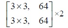
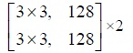
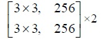
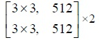
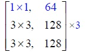
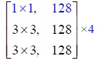
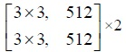

# Building own ResNet with tensorflow api 
## Work on table 1 of the final project
Assuming the structure of the model is<br> 

|Layer name|Output size| |
|:--------:|:---------:|:--------:|
|Conv1| 32 x 32 | 3 x 3, 64 stride=1 |
|Conv2-x| 32 x 32 ||
|Conv3-x| 16 x 16 ||
|Conv4-x| 8 x 8 ||
|Conv5-x| 4 x 4 ||
| | 1 x 1 | average pool, 10-d fc, softmax |

***Note:*** The structure above is different from that in the final project, since the post here is to provide a coding frame to benefit understanding. Remember to change the structure according to the project pdf file.<br> 
To better understand the structure, you may refer to the original resnet paper or ... [my graffiti :)](images/table1.jpg)<br>

### Creating tfrecord data 
Refer to [generate_cifar10_tfrecords.py](utils/generate_cifar10_tfrecords.py)

### Build model 
Refer to [table1/myresnet.py](table1/myresnet.py)

### Train and validate the model 
Refer to [table1/model_train.py](table1/model_train.py)<br> 

Here, I didn't write the test section.

### Run Example 
```bash 
python model_train.py \
  --data_dir='/finalProject/cifar10_data' \
  --train_dir='/finalProject/model'
```

## Work on table 2 
Likewise, we give a similar structure here to help you understand <br> 
**Remember to change the structure in your code in accordance with the final project**

|Layer name|Output size| |
|:--------:|:---------:|:--------:|
|Conv1| 32 x 32 | 3 x 3, 64 stride=1 |
|Conv2-x| 16 x 16 ||
|Conv3-x| 8 x 8 ||
|Conv4-x| 8 x 8 ||
|Conv5-x| 4 x 4 ||
| | 1 x 1 | average pool, 10-d fc, softmax |

For this tabel, we elaborate it in [structure detail](images/table2.jpg)<br>

Still, I have done most of the work in folder `table2`<br> 
For visualization, please see the code in assignment5

If you have your own idea about coding, please ignore this code. <br> 

Any question: email zhuo.su@oulu.fi
